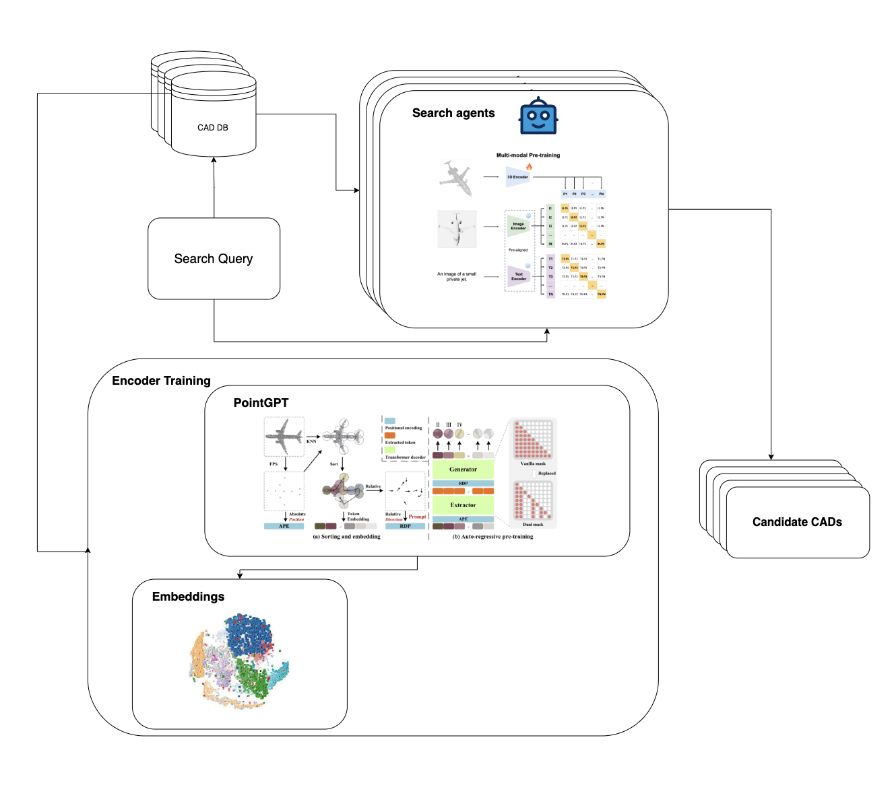
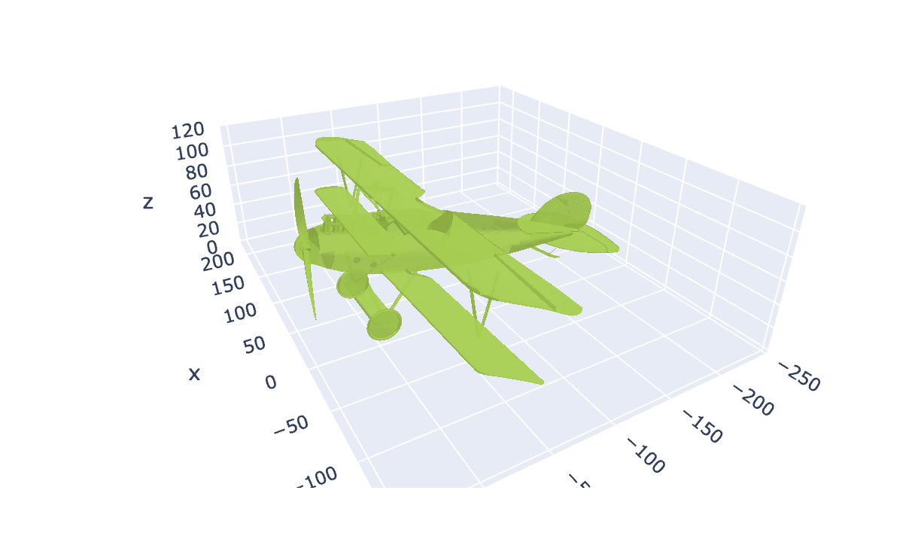

# Multimodal Feature Alignment for 3D Representation Learning

## Introduction
The ULIP (Unified Language-Image-Point cloud) framework is designed to align multimodal features effectively for enhanced 3D representation learning. This method aims to overcome the limitations of existing 3D models by providing cohesive representations that are harmoniously aligned across different modalities, primarily focusing on images, 3D point clouds, and text.




## Datasets
Our project utilizes the following datasets for evaluating the performance in standard and zero-shot 3D classification tasks:
- ModelNet40: A dataset consisting of 3D CAD models from 40 categories.
- ScanObjectNN: A dataset containing 3D point clouds of objects derived from scanned indoor scenes.
- Objaverse-LVIS: A large-vocabulary instance segmentation dataset for 3D object recognition and segmentation.



## Features
- Cross-modal retrieval capabilities.
- Few-shot and zero-shot learning benchmarks.
- Pre-trained models with PointNet, PointBert, PointGPT, and PointMLP as the 3D encoders.
- Interactive interface for 3D shape retrieval based on textual descriptions.


## Usage
To run the demo, simply run the following command:
```
streamlit run ./src/app.py
```
> _Note: The model was tested using a 4xNVIDIA L4 Ubuntu instance_